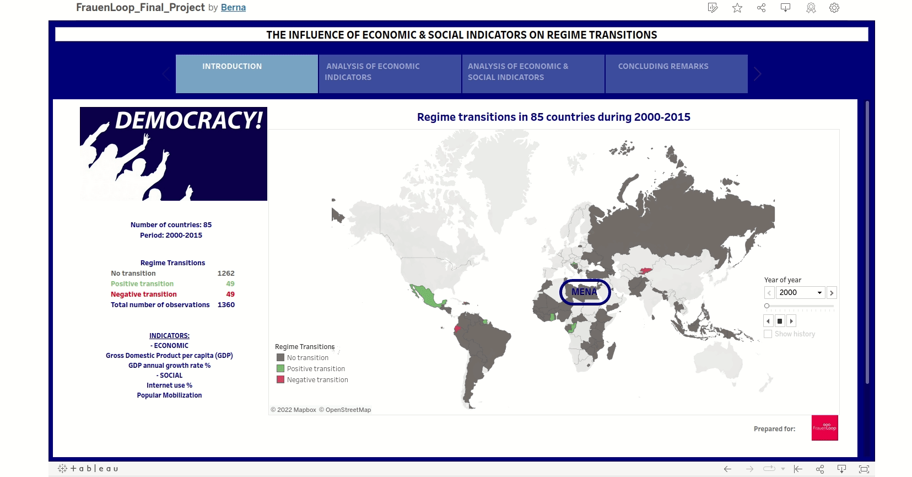

# FrauenLoop Graduation Tableau Project

This project was completed and presented in the end of FrauenLoop 'Introduction to Business Intelligence' course.
This project depicts the influence of economic and social indicators on political regime changes in 85 countries during 2000-2015.
The results reveal that economic indicators have a significant impact on regime transitions. Specifically, autocracies are less stable in countries with incomes between $1001 and $3000, and even less so between $3000 and $5000. Moreover, economic crises may either facilitate or impede democratic transitions depending on the GDP level. Regarding the impact of social indicators on regime changes, popular mobilization and internet use together promote democratization. 

